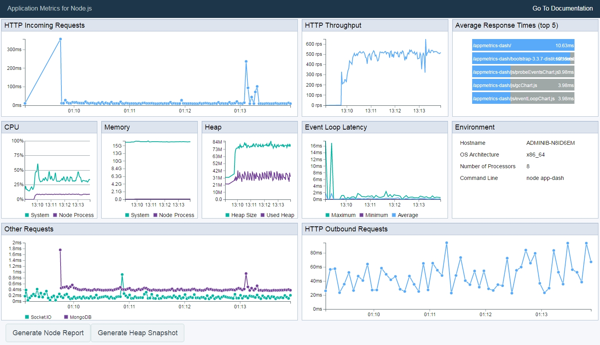

---

copyright:
  years: 2018
lastupdated: "2018-09-18"

---

{:new_window: target="_blank"}
{:shortdesc: .shortdesc}
{:screen: .screen}
{:codeblock: .codeblock}
{:pre: .pre}
{:tip: .tip}

# Using Application Metrics with Node.js apps
{: #metrics}

Learn how to install, access, and understand Node.js application metrics. You can monitor Node.js apps with the [Node Application Metrics](https://developer.ibm.com/code/open/projects/node-application-metrics/) Dashboard to visualize the performance of your Node.js application by displaying metrics in a web-based front end.
{: shortdesc}

## Identifying problems visually
{: #identify-problems}

Application metrics are important for monitoring the performance of your application. Having a live view of metrics like CPU, Memory, Latency, and HTTP metrics is essential to ensure that your application runs effectively over time. Some Cloud services like Cloud Foundry [autoscaling](/docs/services/Auto-Scaling/index.html) rely on these metrics to determine when to add instances to handle peak load and when to scale down, or clean up, instances that are no longer needed to keep costs low.

Application metrics are captured as time series data. Aggregating and visualizing captured metrics can help to identify common performance problems such as:

* Slow HTTP response times on some or all routes
* Poor throughput in the application
* Spikes in demand that cause slowdown
* Higher than expected CPU usage
* High or growing memory usage (potential memory leak)

The built-in Application Metrics Dashboard ([`appmetrics-dash`](https://github.com/RuntimeTools/appmetrics-dash)) also includes a chart for ‘Other Requests’, which shows the database request duration for supported databases (MongoDB, MySQL, Postgres, LevelDB, and Redis), Socket.IO, and Riak events.

A Node Report or a Heap Snapshot can be generated from the dashboard to enable a more in-depth analysis.

## Adding metrics to existing Node.js apps
{: #add-appmetrics-existing}

Add monitoring features to existing Express applications with the [`appmetrics-dash`](https://github.com/RuntimeTools/appmetrics-dash) constructor to pass in a number of configuration options. For example, one of the options uses an existing server rather than have `appmetrics-dash` start an extra server.

### Installing the dashboard

1. For example, use the following simple “Hello World” express application:
  ```js
  var express = require('express')
  var app = express()
  app.get('/', function (req, res) {
      res.send('Hello World!')
  })
  app.listen(3000, function () {
      console.log('Example app listening on port 3000!')
  })
  ```
  {: codeblock}

2. Install the `appmetrics` dashboard with the following [npm](https://nodejs.org/) command:
  ```
  npm install appmetrics-dash
  ```
  {: codeblock}

3. Add `appmetrics-dash` support to your existing app by adding the following code:
  ```js
  var dash = require('appmetrics-dash').attach()
  ```
  {: codeblock}

  This command tells `appmetrics-dash` to use the server that is already created, and add an `appmetrics-dash` endpoint.

  The revised code now looks like the following example:
  ```js
  var express = require('express')
  var app = express()
  var dash = require('appmetrics-dash').attach()
  app.get('/', function (req, res) {
    res.send('Hello World!')
  })
  app.listen(3000, function () {
    console.log('Example app listening on port 3000!')
  })
  ```
  {: codeblock}

## Using metrics from Starter Kits
{: #appmetrics-starterkits}

The Node.js applications that are created from Starter Kits automatically come with `appmetrics-dash`, and its dashboard by default but must be enabled for use.

The appmetrics code can be found in the generated application source file named `/app_name/server/server.js`:
```js
// Uncomment following to enable zipkin tracing, tailor to fit your network configuration:
var appzip = require('appmetrics-zipkin')({
    host: 'localhost',
    port: 9411,
    serviceName:'frontend'
});
```
{: codeblock}

## Accessing the dashboard
{: #access-dashboard}

After you start your application, go to `http://<hostname>:<port>/appmetrics-dash` in a browser.

Use the default `localhost:3001/appmetrics-dash` for apps that are running locally.
{: tip}

The Application Metrics for Node.js monitoring dashboard UI provides a range of metrics, including HTTP requests and event loop latency as seen in the following video [Monitoring Metrics for Node.js](https://www.youtube.com/watch?v=7hV8gKlMYLs&feature=youtu.be).

## Understanding the data
{: #understanding-data}



Most of the data is plotted as line graphs. HTTP Incoming Requests, HTTP Outgoing Requests, and Other Requests show event duration against time. HTTP Throughput shows requests per second. Average Response Times shows the most-used five incoming HTTP requests that took the longest on average. CPU and Memory graphs show system and process usage over time. Heap shows the maximum heap size, and used heap size over time. Event Loop Latency shows latency samples that are taken at intervals from the Node.js event loop, with one point for the shortest latency, one for the average, and one for the longest for each sample taken.

If a graph has points, hovering over them provides additional information. For example, `HTTP Incoming Requests` shows the response time, and the requested url.

A maximum of 15 minutes of data is shown across all graphs.

If a large amount of data is being produced by the application that is being monitored, then the dashboard automatically starts to display data. When you look at the HTTP Incoming Requests chart again, you can see that each point shows all requests for a 2-second period. The following tooltip shows the total number of requests along with the average time taken, and the longest time. The longest time is the value that is plotted.


